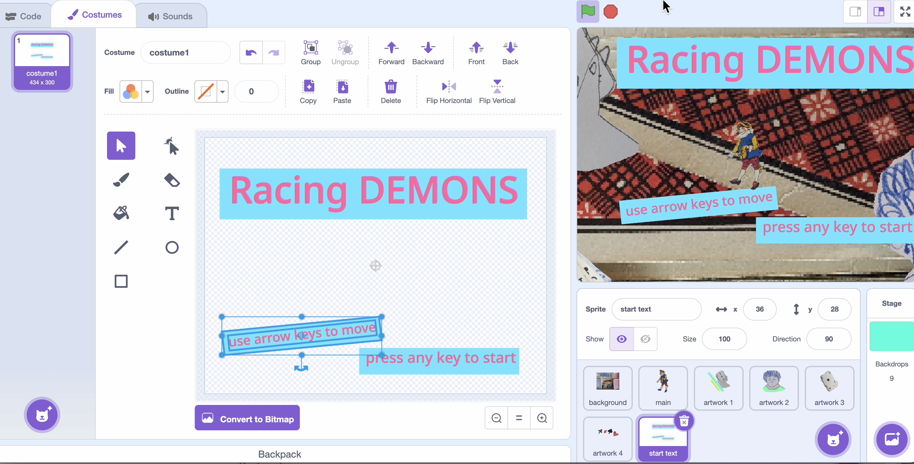
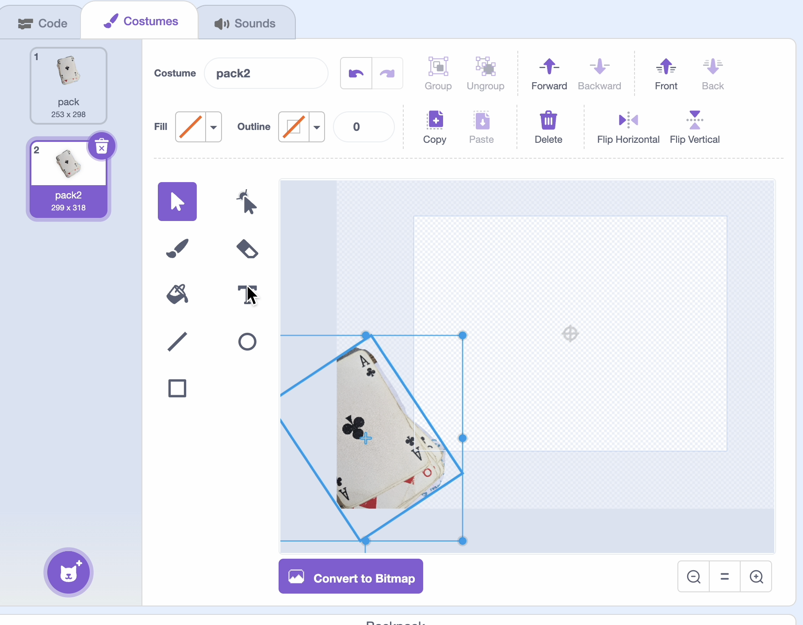

## Challenge
Flatgames are a great way to be creative and try new things out with Scratch. Try some of these challenges — and don't worry about making it neat!

Here are some ideas — have a play! What else can you add? 

--- task ---
### Make start text
Let people know the title of your flatgame and how to play


- [ ] Make a paint sprite and call it "start text"

- [ ] In the costume tab, add the text you want

- [ ] Move the text so it is easy to read, somewhere near the centre:



- [ ] In the start text code add the following blocks to show and hide when the flag is clicked:

```blocks3
+When flag clicked
+show
```

```blocks3
+when [any v] key pressed
+wait (0.2) seconds
+hide
```
--- /task ---

--- task ---
### Add more artwork sprite
Flatgames are great when they are full of art! 


- [ ] Duplicate the artwork 1 sprite and name it artwork 2

- [ ] Upload a new costume and edit it in the same way as the artwork you made earlier.

You can think about where you want to place the new artwork sprites - are they all in a line, or spread out?
--- /task ---

--- task ---
### Change layer of artworks
It can be fun for the player spite to walk under and over the artwork, change some of the layers to do this. 


1. In the artwork sprite add the layer block to the green flag event.

```blocks3
+go to [front v] layer
```
--- /task ---


--- task ---
### Animate the artwork
You could animate some of the artwork to add movement to the flatgame.

- [ ] Decide on which artwork you want to animate. 

- [ ] Select the chosen artwork sprite and duplicate the costume. 

- [ ] Move the new costume very slightly, this will be the next sequence in the animation:



- [ ] Make a new green flag event and add this code:

```blocks3
+when flag clicked
+forever
next costume
wait (1) seconds
```
--- /task ---
