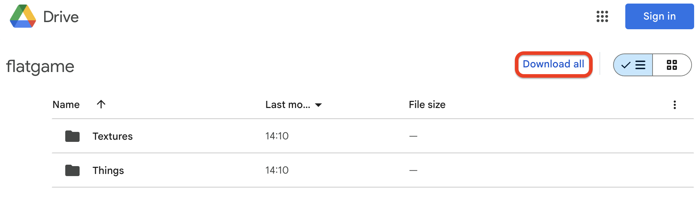
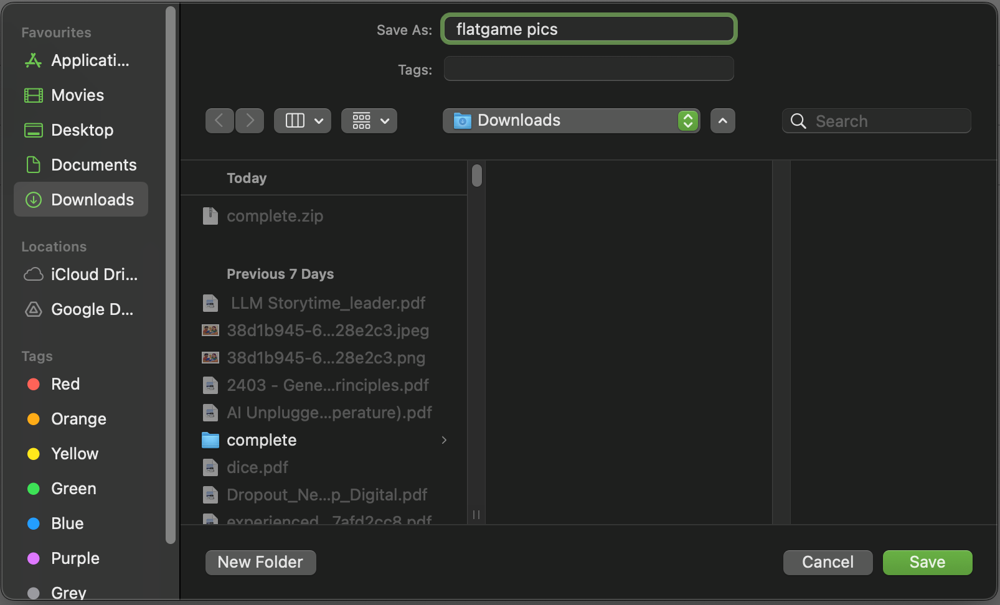

## Make the artwork

<html>

<iframe style="position: absolute; top: 0; left: 0; right: 0; width: 100%; height: 100%; border: none;" src="https://www.youtube.com/embed/D0fkT2GK1ao?rel=0&cc_load_policy=1" allowfullscreen allow="accelerometer; autoplay; clipboard-write; encrypted-media; gyroscope; picture-in-picture; web-share">
</iframe>

 
</html>

You'll start by crafting and making hand-drawn artwork based on your Code Club.

This is your chance to make something fun or imaginative and share what Code Club means to you.

--- task ---
1. Decide what your flatgame will be about. Choose one of the ideas below, or ask your club leader for suggestions:

- The first thing you see when you arrive at Code Club every week.
- A tool you use all the time at Code Club.
- The best game ever made at Code Club!
- If you have an outdoor space — is there something inspiring about it? 
- Your journey to or from Code Club.
- A theme based on right where you are 👀 Look around the room you are in. What do you notice? What is interesting or different about it? 
--- /task ---

When you've decided what your flatgame will be about, you can start making artwork. Remember that flatgames are messy and quick, and don’t need to make sense. Just get started, and don't worry about making more artwork than you need!

--- task ---
2. Draw or craft characters, backgrounds, textures, words, and anything else related to your idea. 

--- /task ---

--- task ---
3. With a tablet or phone, take photos of your artwork. You will use these photos for your game, so try to take clear pictures in a bright room. 📸

If you can't use a camera, there are some images below you can use.
--- /task ---

--- task ---
4. You can also take photos of things around the room that can be used as a background or sprites. These give the flatgame a cut-out look.

**Remember: Don't** take photos of people faces or identifying features.

- Look around for any interesting textures or patterns, and take photos of details you like. 

- Could you make a Raspberry Pi or BBC micro:bit into a sprite? What else could you find?

- Are there any books with some text or pictures that might look cool?

- What about larger things like furniture, or — if you can go outdoors — plants and trees?
--- /task ---

## No camera? No problem!

You can use the following pictures if you don't have a camera, or create some of your own in the paint editor in Scratch.

--- task ---
1. To use the images in the Drive folder, just [follow this link](https://drive.google.com/drive/folders/1zZ06mkskqer21uXyxuO8Hht9szpn9cYc){:target="_blank"} and click `Download all` at the top right of the window that opens.

--- /task ---

--- task ---
2. In the pop-up window, choose the folder you want to save the images to — something easy to get back to, like `Downloads`or `Documents`, is good. Call the file `flatgame` and click `Save`.

--- /task ---

In the next step, you'll upload your artwork to Scratch!
