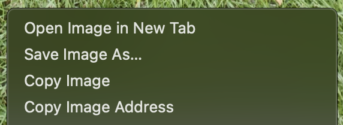
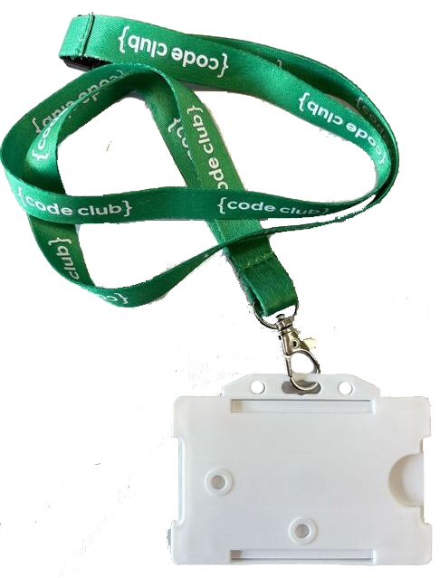

## Make the artwork!

<html>

<iframe style="position: absolute; top: 0; left: 0; right: 0; width: 100%; height: 100%; border: none;" src="https://www.youtube.com/embed/D0fkT2GK1ao?rel=0&cc_load_policy=1" allowfullscreen allow="accelerometer; autoplay; clipboard-write; encrypted-media; gyroscope; picture-in-picture; web-share">
</iframe>

 
</html>

To make a flatgame you start by crafting and making hand-drawn artwork based on your code club.

This is your chance to make something fun or imaginative and share what Code Club means to you.

First decide what your flatgame is about. Chose one of these ideas or ask your club leader if they have some suggestions:

--- task ---
Your favorite thing to do at code club
--- /task ---

--- task ---
The first thing you see when you arrive at Code Club every week
--- /task ---

--- task ---
A tool you use all the time at code club
--- /task ---

--- task ---
The best game ever made at code club!
--- /task ---

--- task ---
If you have an outdoor space - is there something inspiring about it? 
--- /task ---

--- task ---
Your journey to or from code club
--- /task ---

--- task ---
Or make a flatgame theme based on right where you are. 👀 Look around the room you are in, what do you notice, what is interesting or different about it? 
--- /task ---

When you have decided on what your flatgame is about you can start making artwork. Remember that flagames are messy and quick, and don’t need to make sense! Just get started and make way more than you need!

--- task ---
Draw or craft characters, backgrounds, textures, words, or anything else related to your code club. 

--- /task ---

--- task ---
With a tablet or phone take photos of your artwork. This will be used for your game, so try to take a clear picture in a light room. 📸

If you can't use a camera, there are some images below you can use.
--- /task ---

You can also take photos of things around the room that can be used as a background or sprites. These give the flatgame a cut-out look.

**Don't** take photos of people faces or identifying features.

--- task ---
Look around for any interesting textures or patterns, take photos of details you like. 
--- /task ---

--- task ---
Could you make a Raspberry Pi or Micro Bit into a sprite? What else could you find?
--- /task ---

--- task ---
Are there any books with some text or pictures that might look cool?
--- /task ---

--- task ---
What about larger things like furniture, or if you can go outdoors - plants and trees!
--- /task ---

You can use the following pictures if you don't have a camera, or create some of your own in the paint editor in Scratch!

--- task ---
To use the images in the collapse below, just right click (two-fingers on Mac) on the image you want to use and choose 'Save Image As'.

--- /task ---

--- task ---

In the popup window, choose the folder you want to save the images to - something easy to get back to, like `Downloads`or `Documents` is good.
]
--- /task ---

--- collapse ---

---

title: No camera? Use these pictures!

---

### Things
  
  
  
  
  
  
  
  
  
  
  
  
  
  
  
  
  

### Textures / Patterns
  
  
  
  

--- /collapse ---

In the next step, upload your artwork to Scratch!