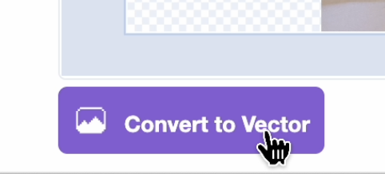

## Add a background 

<html>
<div style="position: relative; overflow: hidden; padding-top: 56.25%;">
<iframe style="position: absolute; top: 0; left: 0; right: 0; width: 100%; height: 100%; border: none;" src="https://www.youtube.com/embed/OcFh8-W3wBg?rel=0&cc_load_policy=1" allowfullscreen allow="accelerometer; autoplay; clipboard-write; encrypted-media; gyroscope; picture-in-picture; web-share">
</iframe>
</div><br>
</html>

--- task ---
1. Open the Scratch [starter project](http://rpf.io/flatgame){:target="_blank"}
--- /task ---

--- task ---
2. In the 'Upload Costume' area for the background sprite, choose one of your photos. Rename the sprite "background" and drag it to the top of the list of costumes.


--- /task ---

--- task ---
3. Delete the placeholder costume, but make sure you **do not** delete the zoom costume.

--- /task ---

--- task ---
4. Click the purple 'Convert to vector' button beneath the image editor. 


--- /task ---

--- task ---
5. With the select tool, rotate and resize the photo so that it covers the paint area.

--- /task ---


--- task ---
6. In the starter code on your background sprite, change the pull-down menu in the `switch costumes`{:class="block3looks"} block to say background:

```blocks3
when flag clicked
switch costume to (zoom v)
set size to [400]%
+switch costume to (background v)
go to [back v] layer
```
--- /task ---

This is how we make the background sprite really big!
