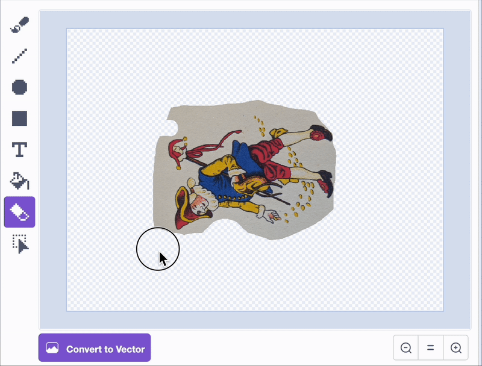
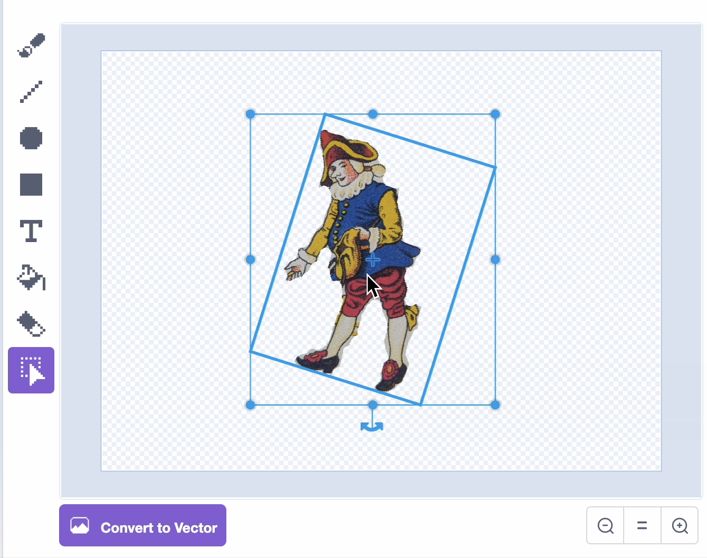
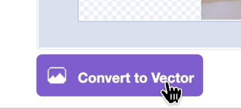
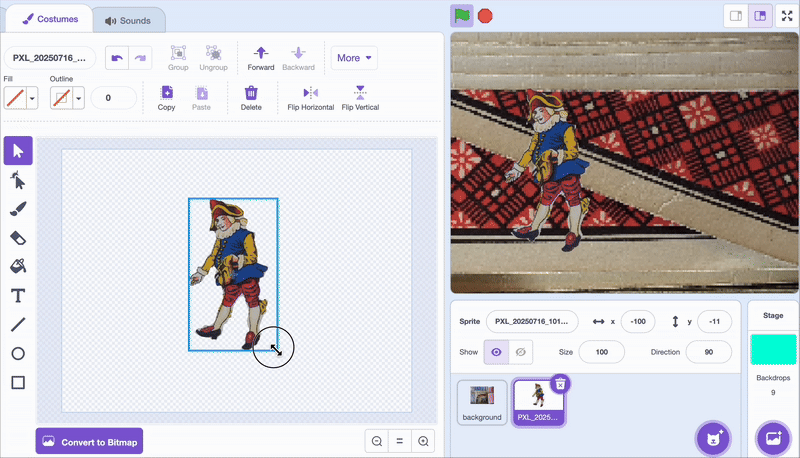
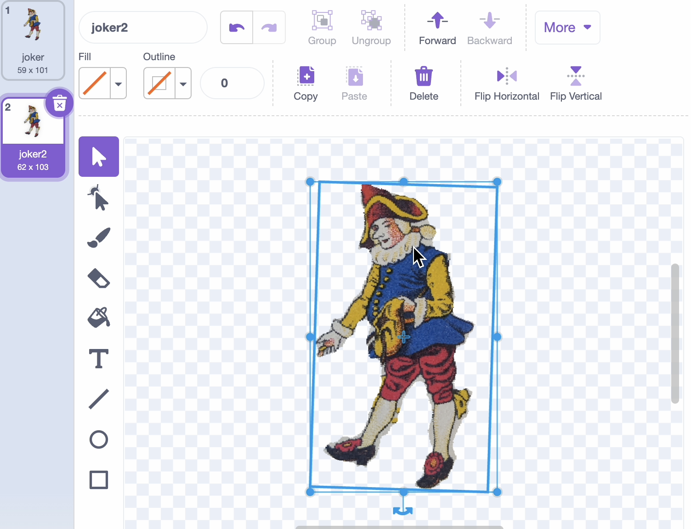

## Add a player sprite

<html>

<iframe style="position: absolute; top: 0; left: 0; right: 0; width: 100%; height: 100%; border: none;" src="https://www.youtube.com/embed/vX0Lymnyizg?rel=0&cc_load_policy=1" allowfullscreen allow="accelerometer; autoplay; clipboard-write; encrypted-media; gyroscope; picture-in-picture; web-share">
</iframe>

 
</html>

The player sprite explores the flatgame, checking out the different drawings and textures.

--- task ---
1. Upload a new sprite, pick one of your photos, and rename it 'player'.
--- /task ---

--- task ---
2. Go to the costumes tab and edit the image. Use the eraser tool to remove any part of the image you don't want. Change the size of the eraser tool for smaller details.

This doesn't have to be perfect — flatgames have a cutout collage effect, so it can be roughly done.

--- /task ---

--- task ---
3. With the select tool, drag over the image to select all. Rotate and centre the image by lining up the cross.

--- /task ---

--- task ---
4. Convert to vector

--- /task ---

--- task ---
5. Use the select tool to resize the sprite to how you want it. 

It should be quite small so that there is plenty of room on the stage around it.

--- /task ---

--- task ---
6. When you have your sprite exactly how you want it, right click and duplicate the costume.

Move the new costume and/or rotate it very slightly. This will animate it to make it look like it is moving.

--- /task ---

