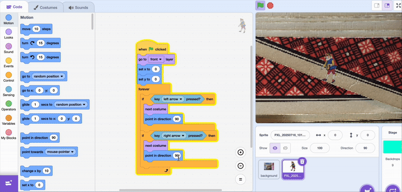

## Moving the player sprite

The player sprite will animate to look like it is moving, but it is actually the background that is moving, which you set up earlier.

--- task ---
When the game starts you want the player sprite to be at the front. 

In the player sprite code tab, add a layer block when the flag is clicked:

```blocks3
+when flag clicked
+go to [front v] layer
```
--- /task ---


--- task ---
To make it look like it is moving towards each side, use a direction block when the arrow keys are pressed.

```blocks3
when flag clicked
go to [front v] layer
forever
if <key (left arrow v) pressed> then
+point in direction (130)
next costume
end
if <key (right arrow v) pressed> then
+point in direction (-130)
next costume
end
```
--- /task ---

Test your code! Press the green flag and the player sprite should move when you use the left and right keys.

--- task ---
Your direction might be different - test out a few angles with the direction block until it looks like your srite is facing the right way as every sprite will be different depending on what the drawing looks like.


--- /task ---

--- task ---
Now use an `operator`{:class="operators"} block to add the up and down keys. These don't need a direction, so the code is the same for both up and down.

```blocks3
when flag clicked
go to [front v] layer
forever
if <key (left arrow v) pressed> then
point in direction (130)
next costume
end
if <key (right arrow v) pressed> then
point in direction (-130)
next costume
end
+if <<key (up arrow v) pressed> or <key (up arrow v) pressed >> then
next costume
end
```
--- /task ---
