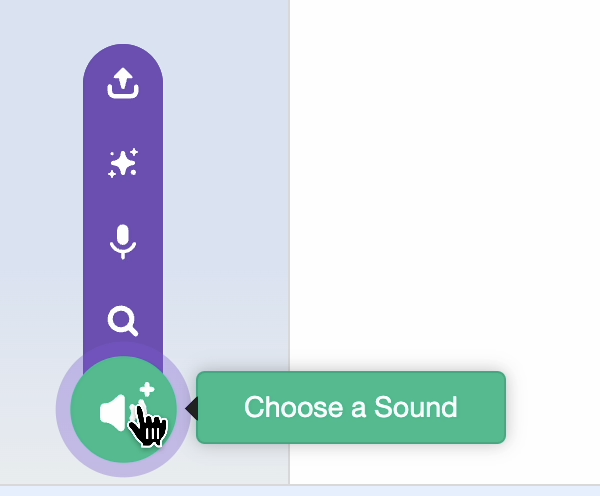
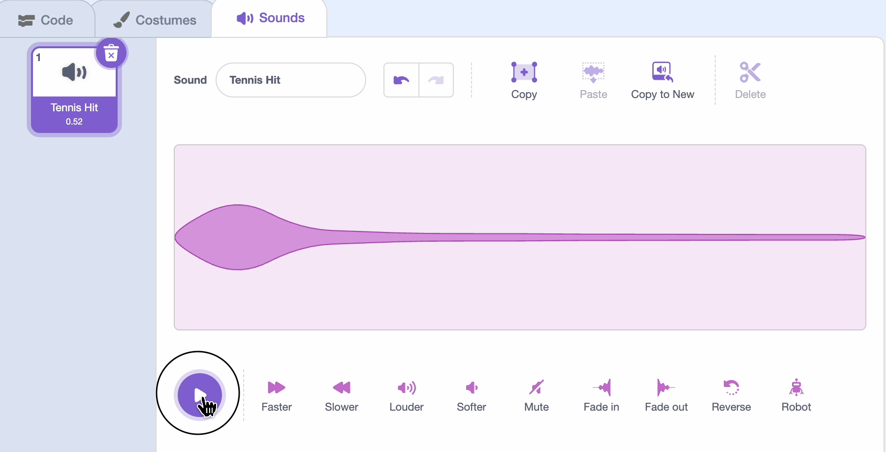

## Add sound

Test it out and think of a sound that your background might make when the player sprite is walking across it. 

For example, a background of leaves might make a crunch sound. 

--- task ---
1. Open the Sounds tab and click 'Choose a sound'.


Hover over the play button to try out sounds until you find one that would work for a walking sound. Shorter sounds work best. 

--- /task ---

--- task ---
2. Click on the sound to select it.


--- /task ---

--- task ---
3. Edit the sound to make it softer or faster by clicking the icons in the editor.



--- /task ---

--- task ---
4. Add sound blocks to your code:

```blocks3
when flag clicked
go to [front v] layer
forever
if <key (left arrow v) pressed> then
next costume
+play sound (Wood Tap v) until done
end
if <key (right arrow v) pressed> then
next costume
+play sound (Wood Tap v) until done
end
if <<key (up arrow v) pressed> or <key (up arrow v) pressed >> then
next costume
+play sound (Wood Tap v) until done
end
```
--- /task ---

--- task ---

5. **Test it again** — how does the sound work out? Is the direction okay? If you need to tweak volume or direction, you can go back and change it in your code.

--- /task ---
