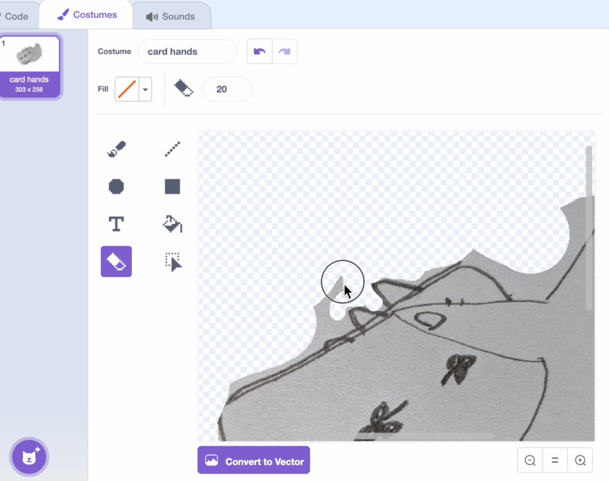
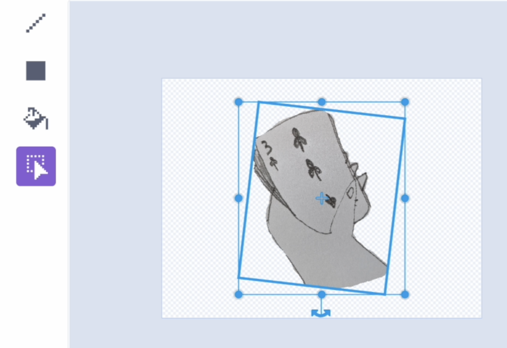
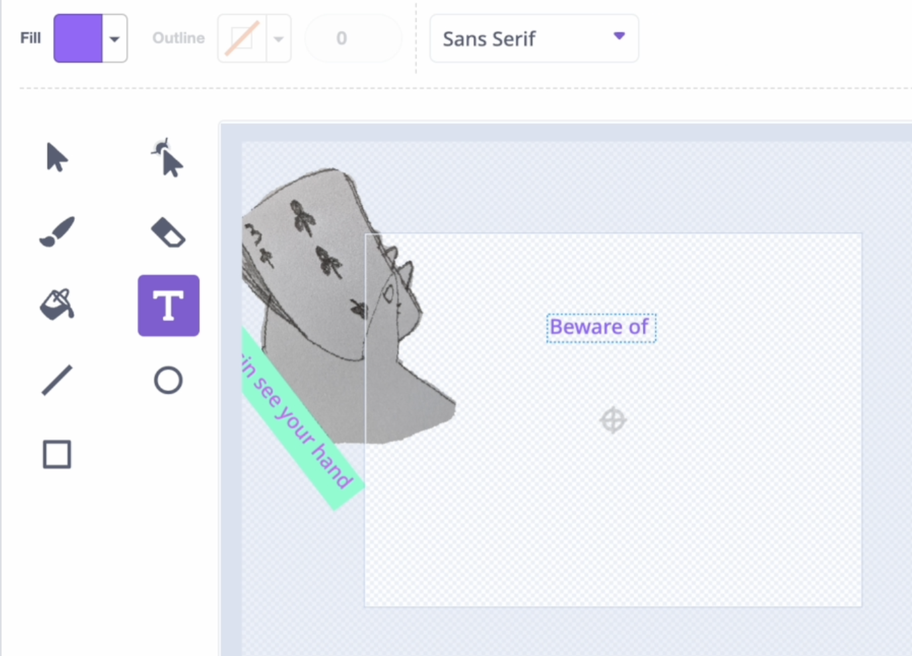

## Adding artwork!
<html>
<div style="position: relative; overflow: hidden; padding-top: 56.25%;">
<iframe style="position: absolute; top: 0; left: 0; right: 0; width: 100%; height: 100%; border: none;" src="https://www.youtube.com/embed/S2YRnaSove0?rel=0&cc_load_policy=1" allowfullscreen allow="accelerometer; autoplay; clipboard-write; encrypted-media; gyroscope; picture-in-picture; web-share">
</iframe>
</div><br>
</html>


In this step you can get creative adding textures, drawings, text, or any other artwork that you want to complete your flatgame.

--- task ---
Upload a new sprite and name it "artwork 1"

Use one of your drawings or a photo you have taken
--- /task ---

--- task ---
Remove any background you don't want - this has a collage effect so don't be too neat!


--- /task ---

--- task ---
Use the select tool and line up with the centre.

--- /task ---

--- task ---
Convert to Vector

--- /task ---

--- task ---
Add this code so that the artwork sprite moves in the same way as the background.

```blocks3
+when flag clicked
+forever
set x to (move x)
set y to (move y)
```
--- /task ---

--- task ---
Resize and position the sprite. You can zoom in and out with the - and +. 

For best results position the artwork sprite at the edges of the paint window, so that your player sprite can explore the artwork further.
--- /task ---


--- task ---
Add text to tell the story of your artwork or images.

This can be playful. You could:

- write a few words about why you chose it
- describe it
- repeat and overlap words

Change the colours, size and position of the text.

--- /task ---

Test it out! Your artwork sprite should move with the background.